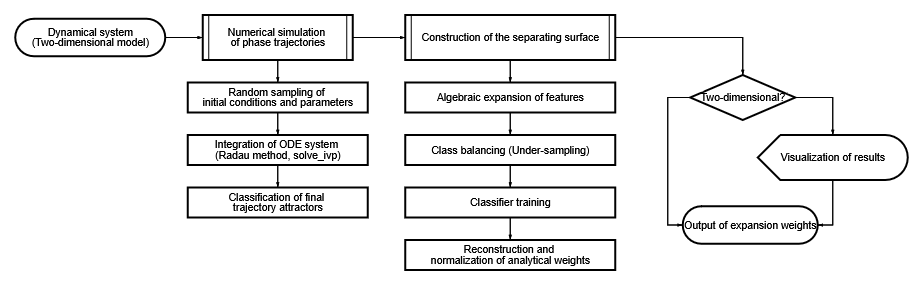

# Bistable System Approximation

Software pipeline for bistable dynamic system omega-separatrix approximation. 


## Usage

The framework is designed as an extensible pipeline. To apply it to your own scientific or mathematical problem, you only need to follow two steps: implement your specific system as a subclass of `Task`, and plug it into either the provided pipeline or your custom execution script.

### 1. Implement Your Custom Task

Create a new class inheriting from `Task`. You must define your system's dimensions, the number of equilibria points, and implement the abstract methods for system equations, the Jacobian matrix, and data sampling.

```python
from task import Task, Parameters, Eigen
from numpy.typing import NDArray
import numpy as np

class MyCustomSystem(Task):
    equilibria_points_count = 3  # Target number of equilibria
    dimensions = 3               # e.g., for a 3D system

    def system(self, z: NDArray, parameters: Parameters) -> NDArray:
        # Define your differential equations here
        pass

    def jacobian(self, z: NDArray, parameters: Parameters) -> NDArray:
        # Define the Jacobian matrix for root-finding and eigenvalue analysis
        pass

    def equilibria_seeds(self, parameters: Parameters) -> NDArray:
        # Initial guesses for Scipy's root finder
        pass

    def multistable_condition(self, parameters: Parameters) -> bool:
        # Conditions under which the system exhibits multistability
        pass

    def sample(self) -> tuple[NDArray, Parameters]:
        # Logic to generate random initial states and parameter sets
        pass

    def classify_point(self) -> int:
        # Define your attractor/phase classification logic
        pass

    def expansion(self, z: NDArray, parameters: Parameters, saddle_point: NDArray, eigens: list[Eigen], weights = None) -> list[NDArray]:
        # Feature expansion terms for the machine learning model
        pass
```
### 2. Run the Pipeline

Once your task is ready, you can orchestrate data generation, model training, and phase-space plotting. You can use the standard pipeline structure provided in main.py or write your own workflow using the core modules:
```Python

import data
import ml
import exampling
import matplotlib.pyplot as plt
from my_task import MyCustomSystem

# 1. Initialize your custom task
task = MyCustomSystem()

# 2. Generate dataset using parallel processing
dataset = data.generate_dataset(task, size=5000, processes=6)

# 3. Train the LinearSVC model and extract weights/metrics
weights, statistics = ml.train(task, dataset, balance=True)
print(f"Trained Coefficients: {weights}")
print(f"Model Metrics: {statistics}")

# 4. Generate a separate evaluation sample and visualize the boundaries
example_sample = data.generate_example(task, size=100, processes=6)

# Pass any protocols matching the Equation signature (e.g., custom approximations)
figure, axis = exampling.drawExample(
    task, 
    [task.expansion, task.saddle_omega_separatrix, task.RGR], 
    example_sample, 
    weights
)

axis.legend()
plt.show()
```
#### Pipeline Flowchart

Whether you use the default setup or customize it, the underlying architecture always operates sequentially:

## Academic Background & Theory

This software framework was developed as part of a Bachelor's thesis focused on numerical analysis and boundary approximations of multistable dynamical systems. 

The theoretical foundation includes:
- Multistability Analysis: Identifying parameter regions where system attractors coexist using deterministic conditions.
- Boundary Approximation: Applying Support Vector Machines (LinearSVC) to approximate basins of attraction boundaries without computationally heavy brute-force cell mapping.
- Manifold Analysis: Utilizing localized eigenvectors and eigenvalues around saddle points to determine invariant manifolds (separatrices).

### Project Materials
- **Full Thesis (PDF):** You can download the complete text of the academic work with detailed proofs, mathematical derivations, and biological/physical context from the [Latest Releases](../../releases) section.
